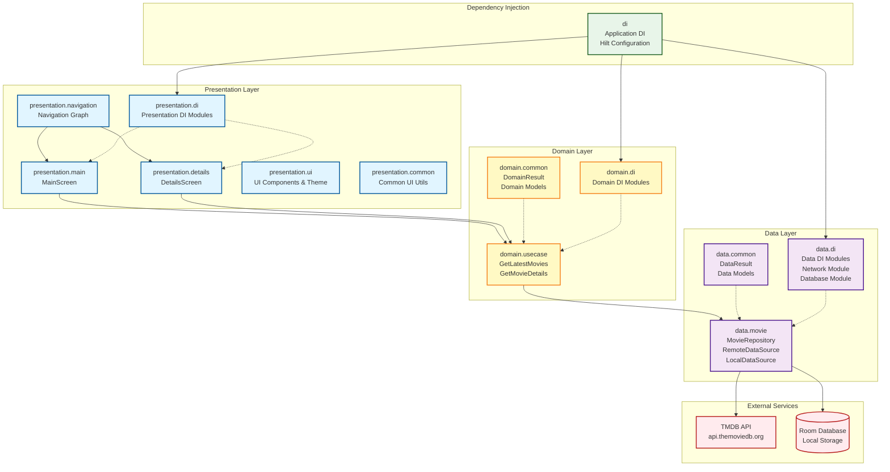
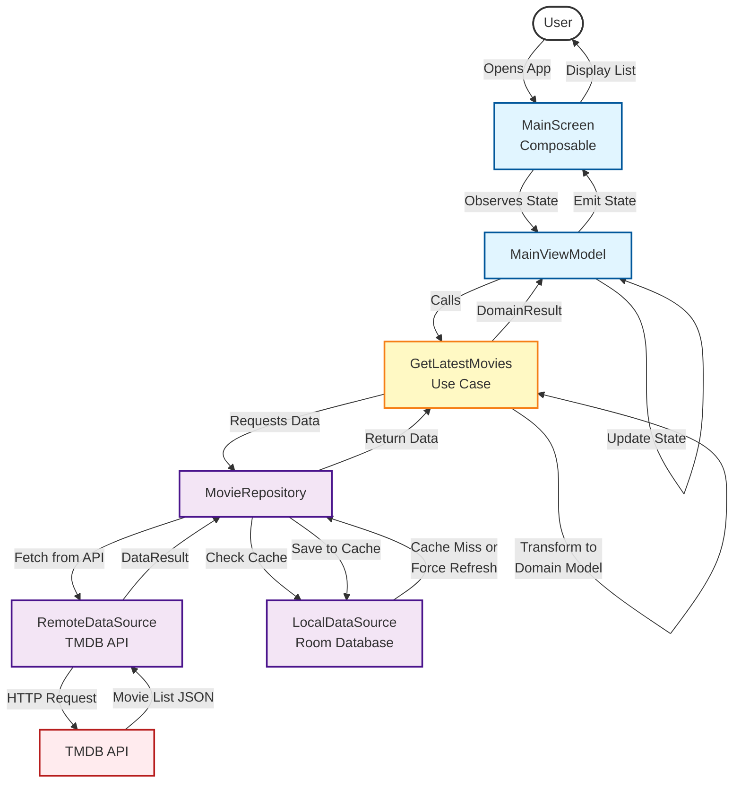

# The MovieDB Android Application (TMDBApp)

## Table of Contents

- [The MovieDB Android Application (TMDBApp)](#the-moviedb-android-application-tmdbapp)
  - [Table of Contents](#table-of-contents)
  - [Introduction](#introduction)
  - [API Key](#api-key)
  - [Features](#features)
  - [Key Technical Decisions](#key-technical-decisions)
    - [Libraries](#libraries)
    - [The project support two scenarios](#the-project-support-two-scenarios)
  - [Architecture](#architecture)
    - [Deployment Diagram](#deployment-diagram)
    - [Use Case Diagrams](#use-case-diagrams)
  - [Screenshots](#screenshots)
  - [Getting Started](#getting-started)
    - [Prerequisites](#prerequisites)
    - [Installation](#installation)
  - [Usage](#usage)
  - [License](#license)
  - [Acknowledgments](#acknowledgments)

## Introduction

The application created in this repo is a demo application which intention is to reflect
how a modern application should be structured.

## API Key

IMPORTANT! In order to make this work, you should the following properties to your local.properties file:
```text
API_BASE_URL=https://api.themoviedb.org/3/
SERVICE_TOKEN=<your TMDB token>
```

## Features

The application allows the user:
* To see a list of latest movies as defined by the TMDBApi.
* To see the details of such movies when each of them are selected.
* Display the data in a way that can be read correctly depending on the orientation.
* Display the labels used in the application in English or Spanish.

## Key Technical Decisions

### Libraries
The project is written 100% in Kotlin since this is the actual standard. 

No Java code should be used in new features in modern application written from scratch.
 
* Jetpack Compose
* Kotlin
* Code organized following latest Google's Architecture Guideline
* Unidirectional Data Flow
* Dependency Injection
* Storage Support using Room

### The project support two scenarios

* List A page of latest movies
* Get the details of a movie

## Architecture

The application follows **Clean Architecture** principles with three distinct layers: Presentation, Domain, and Data. This separation ensures maintainability, testability, and scalability.

### Deployment Diagram

The deployment diagram shows how the application is structured across the three main architectural layers and how they interact with external services.



[📄 View detailed deployment diagram](docs/architecture/deployment-diagram.md)

### Use Case Diagrams

#### Use Case 1: Get Latest Movies

This flow represents how users view the list of latest movies when opening the app.



[📄 View detailed use case documentation](docs/architecture/use-case-get-latest-movies.md)

#### Use Case 2: Get Movie Details

This flow shows what happens when a user selects a movie to view its detailed information.

```mermaid
graph TB
    User([User])
    MainScreen[MainScreen<br/>Movie List]
    DetailsScreen[DetailsScreen<br/>Composable]
    DetailsViewModel[DetailsViewModel]
    GetMovieDetails[GetMovieDetails<br/>Use Case]
    MovieRepository[MovieRepository]
    RemoteDS[RemoteDataSource<br/>TMDB API]
    LocalDS[LocalDataSource<br/>Room Database]
    
    User -->|Selects Movie| MainScreen
    MainScreen -->|Navigate with<br/>Movie ID| Navigation[Navigation]
    Navigation -->|Route to Details| DetailsScreen
    DetailsScreen -->|Observes State| DetailsViewModel
    DetailsViewModel -->|Calls with ID| GetMovieDetails
    GetMovieDetails -->|Requests Details| MovieRepository
    
    MovieRepository -->|Check Cache| LocalDS
    
    LocalDS -->|Cache Miss| MovieRepository
    MovieRepository -->|Fetch from API| RemoteDS
    RemoteDS -->|HTTP Request<br/>GET /movie/{id}| API[TMDB API]
    API -->|Movie Details JSON| RemoteDS
    RemoteDS -->|DataResult| MovieRepository
    
    MovieRepository -->|Save to Cache| LocalDS
    MovieRepository -->|Return Data| GetMovieDetails
    
    GetMovieDetails -->|Transform to<br/>Domain Model| GetMovieDetails
    GetMovieDetails -->|DomainResult| DetailsViewModel
    DetailsViewModel -->|Update State| DetailsViewModel
    DetailsViewModel -->|Emit State| DetailsScreen
    DetailsScreen -->|Display Details| User

    classDef userStyle fill:#fff,stroke:#333,stroke-width:2px
    classDef uiStyle fill:#e1f5ff,stroke:#01579b,stroke-width:2px
    classDef domainStyle fill:#fff9c4,stroke:#f57f17,stroke-width:2px
    classDef dataStyle fill:#f3e5f5,stroke:#4a148c,stroke-width:2px
    classDef externalStyle fill:#ffebee,stroke:#b71c1c,stroke-width:2px

    class User userStyle
    class MainScreen,DetailsScreen,DetailsViewModel,Navigation uiStyle
    class GetMovieDetails domainStyle
    class MovieRepository,RemoteDS,LocalDS dataStyle
    class API externalStyle
```

[📄 View detailed use case documentation](docs/architecture/use-case-get-movie-details.md)

## Screenshots
Here are some screenshots of the app.

<table>
  <tr>
    <td colspan="2" style="text-align:center;">
        
    </td>
  </tr>
  <tr>
    <td style="text-align:center;">
      
    </td>    
    <td>
            
    </td>    
  </tr>
  <tr>
    <td style="text-align:center;">
      
    </td>    
    <td>
          
    </td>    
  </tr>
</table>

## Getting Started

### Prerequisites

List any prerequisites for running the project. This could include Android Studio, specific SDK
versions, etc.

- Java 1.8 or higher
- Android Studio 2024 or superior
- Android SDK version 29 & 35

### Installation

Provide step-by-step instructions on how to set up and run your project.

1. Clone the repository:
   ```sh
   git clone git@github.com:pperotti/android-tmdb-app.git
   ```
2. Open the project in Android Studio.
3. Build and run the application on an emulator or connected device.

## Usage

All you have to do is selecting the app's icon and wait for the app to load the list of most recent movies available.

Once the list is displayed, you can select an individual movie to see its details.

All screens support a personalized displayed depending on the device's orientation.

## License

This project is licensed under the [MIT License](https://choosealicense.com/licenses/mit/) - see the
[LICENSE.md](https://github.com/username/repository/blob/master/LICENSE.md) file for details.

## Acknowledgments

All the project created here was done by Pablo Perotti

- [github.com/pperotti] (GitHub)

```