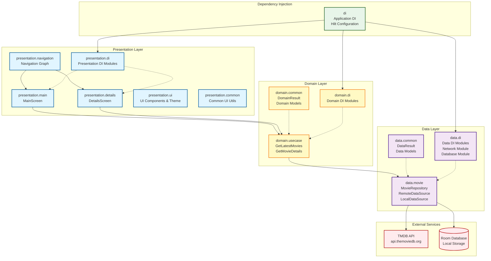

# Deployment Diagram

This diagram shows the Clean Architecture layers and main packages within the TMDB Android Application.

## Layer Descriptions

### Presentation Layer
- **Main Package**: UI screens and ViewModels for displaying movie lists
- **Details Package**: UI screens and ViewModels for movie details
- **Navigation**: Navigation graph and routing logic
- **UI Package**: Reusable Compose components and theme configuration
- **Common**: Shared presentation utilities
- **DI**: Hilt modules for presentation layer dependencies

### Domain Layer
- **Use Case Package**: Business logic interfaces and implementations
  - `GetLatestMovies`: Retrieves paginated list of latest movies
  - `GetMovieDetails`: Retrieves detailed information for a specific movie
- **Common**: Domain models and result wrappers
- **DI**: Hilt modules for domain layer dependencies

### Data Layer
- **Movie Package**: Repository and data source implementations
  - `MovieRepository`: Single source of truth for movie data
  - Remote and local data sources
- **Common**: Data models (DTOs) and result wrappers
- **DI**: Network configuration (Retrofit, OkHttp) and database setup (Room)

### External Dependencies
- **TMDB API**: RESTful API providing movie data
- **Room Database**: Local SQLite database for caching

### Dependency Injection
- **Application DI**: Hilt configuration at application level
- Coordinates dependency provision across all layers
