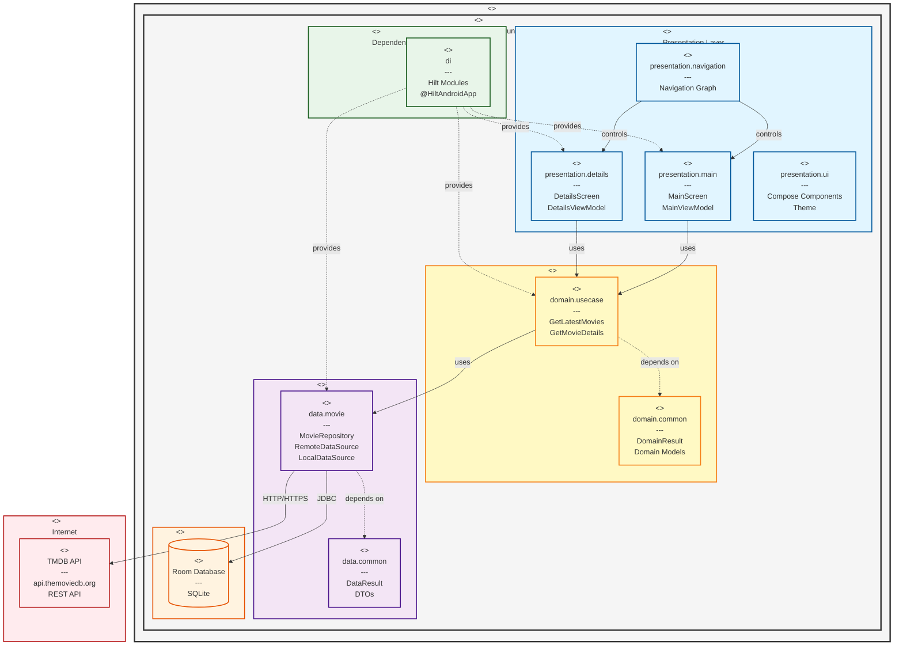

# Deployment Diagram

This UML 2.5 deployment diagram shows the Clean Architecture layers and component distribution within the TMDB Android Application.

## UML 2.5 Compliance

This diagram follows UML 2.5 deployment diagram specifications:

### Stereotypes Used
- **`<<device>>`**: Physical computing resource (Android Device)
- **`<<execution environment>>`**: Software platform (Android Runtime)
- **`<<node>>`**: Computational resource (architectural layers)
- **`<<component>>`**: Modular software units (packages and modules)
- **`<<artifact>>`**: Physical file or database (SQLite database)
- **`<<cloud>>`**: Internet-based services

### Relationships
- **Solid arrows**: Dependencies and communication paths
- **Dashed arrows**: Deployment/provision relationships
- **Labels**: Communication protocols (HTTP/HTTPS, JDBC)

## Architecture Layers

### Device Layer
- **Android Device**: Physical mobile device running the application
- **Android Runtime (ART)**: Execution environment for the app

### Application Layers

#### Presentation Layer (Node)
Components handling UI and user interaction:
- **presentation.main**: Main screen with movie list
- **presentation.details**: Movie details screen
- **presentation.navigation**: Navigation graph and routing
- **presentation.ui**: Reusable Compose components and theme

#### Domain Layer (Node)
Business logic components:
- **domain.usecase**: Business rules implementation
  - `GetLatestMovies`: Retrieves paginated movie lists
  - `GetMovieDetails`: Retrieves specific movie details
- **domain.common**: Domain models and result wrappers

#### Data Layer (Node)
Data access and management components:
- **data.movie**: Repository and data source implementations
  - `MovieRepository`: Single source of truth
  - `RemoteDataSource`: API communication
  - `LocalDataSource`: Database operations
- **data.common**: Data transfer objects (DTOs) and result types

#### Dependency Injection (Node)
Infrastructure for dependency management:
- **di**: Hilt configuration and modules
- Provides instances across all layers

### External Systems

#### Local Storage
- **Room Database**: SQLite-based local persistence
- Connected via JDBC protocol
- Stores cached movie data

#### Cloud Services
- **TMDB API**: RESTful web service
- Accessible via HTTP/HTTPS
- Provides movie data and images

## Communication Protocols

- **HTTP/HTTPS**: Secure communication with TMDB API
- **JDBC**: Database access protocol for Room
- **Dependency Injection**: Hilt provides component instances

## Deployment Characteristics

- **Single Device Deployment**: All application components run on the Android device
- **Client-Server Architecture**: App acts as client to TMDB API
- **Local Caching**: Room database enables offline functionality
- **Layered Architecture**: Clean separation of concerns across layers
