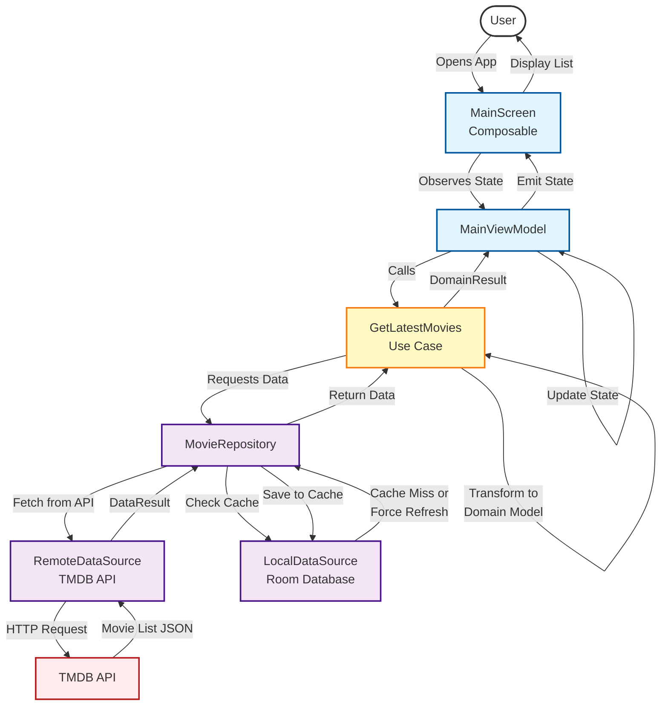

# Use Case: Get Latest Movies

This diagram illustrates the flow when a user views the list of latest movies.

## Flow Description

### Actor
- **User**: End user of the mobile application

### Preconditions
- App is installed and has network connectivity
- TMDB API token is configured in `local.properties`

### Main Flow

1. **User opens the app**: The user launches the TMDB application
2. **MainScreen initializes**: The Composable screen is rendered
3. **ViewModel requests data**: MainViewModel calls GetLatestMovies use case
4. **Use case delegates to repository**: GetLatestMovies invokes MovieRepository
5. **Repository checks cache**: LocalDataSource is queried for cached data
6. **Fetch from API (if needed)**: 
   - If cache is empty/expired or force refresh is requested
   - RemoteDataSource makes HTTP request to TMDB API
7. **API responds**: Returns JSON with movie list
8. **Data transformation**: 
   - RemoteDataSource transforms JSON to DataResult
   - Repository saves to local cache
   - Use case transforms DataResult to DomainResult
9. **State update**: ViewModel updates UI state with movie list
10. **UI renders**: MainScreen displays the list of movies to the user

### Postconditions
- Movie list is displayed on screen
- Data is cached locally for offline access

### Alternative Flows

#### No Network Connection
- If network is unavailable, cached data is displayed
- Error message shown if no cache exists

#### API Error
- Error state is displayed to user
- Retry option is provided

### Key Components

- **MainScreen**: Jetpack Compose UI displaying movie grid
- **MainViewModel**: Manages UI state and handles user interactions
- **GetLatestMovies**: Business logic for retrieving movie list
- **MovieRepository**: Coordinates between remote and local data sources
- **RemoteDataSource**: Handles API communication via Retrofit
- **LocalDataSource**: Manages Room database operations
